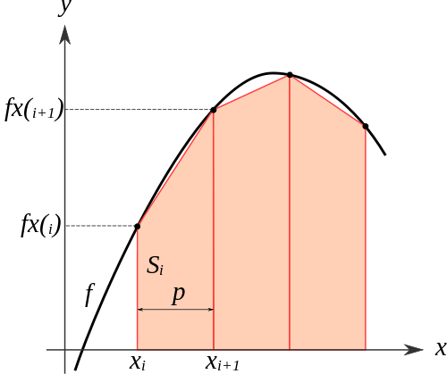

# Race Conditions

In this activity, you will practice using reduction to avoid race condtions.

This is also the first activity where you will use a remote server. You will
need to use ssh (secure shell) to login to the remote machine called
wulver.macalester.edu. Use the user name and password that you were given.

**NOTE:** At the terminal on wulver asking for your password, when you type your
password, it will appears as if you are typing nothing at all. This is a
security measure in the linux terminal (so people do not even know how long your
password is).

You will need to `git clone` once logged in to wulver in order to access the
starter code on that machine.

### Trapezoidal Approximation

The code provided here integrates by computing the area under the curve of the
integral of a function, f(x), using the trapezoidal rule. In particular, this
code will use the trapezoid areas at points along the curve, like this:

This image was taken from [this
explanation](https://chemicalstatistician.wordpress.com/2013/12/14/conceptual-foundations-and-illustrative-examples-of-trapezoidal-integration-in-r/),
which you can refer to for more details.

To understand the code, it is useful to note that the integral approximation,
which is the computation of sum of the areas of the trapezoids with constant
interval width, can be converted to the following expansion:

 ∆x * 1/2 * (f(x_0) + f(x_1) + f(x_2) + ... + f(x_n-1) + f(x_n))

In the example code you are given, the variable *h* is the same as ∆x. We use
this above summation, and we compute the integral from 0 to pi of sin(x), which
we know should be 2.0. You could experiment with other known values of integrals
of other functions if you wish to explore this and have time later.

### Further Reading

[Wikipedia page](https://en.wikipedia.org/wiki/Trapezoidal_rule) - see the
section called 'non-uniform grid'.

[Demo describing the trapezoidal
rule](http://www.math.umd.edu/~jmr/141/SimpsonDemo.html)

[Lots of detail from Khan
Academy](https://www.khanacademy.org/math/calculus-home/integration-calc/trapezoidal-rule-calc/v/rectangular-and-trapezoidal-riemann-approximations)

# Problem Definition

You are provided with a working sequential implementation of this integration in
`trap-seq.c`.

Update `trap-omp.c` to produce correct multi-threaded code.
You will need to decide what variables should be shared among the threads, which
should be private to each thread, and which need *reduction* due to being shared
by all threads.

When you have fixed the code, `make` with the Makefile provided.

## Determine timings

The code already has timing built into it. The `trap-seq` executable can take in
varying values for the number of 'trapezoids' used in the computation. You run
it like this:

    ./trap-seq 4194304
    
We refer to the number of trapezoids, which represent the work being done, as
the **problem size**. Try running it for a few problem sizes, using powers of 2
from 1048576 onwards.

Make a copy of [this Google spreadsheet](
https://docs.google.com/spreadsheets/d/1kzkEGSDk4FfLXiZwJDmdKm7Vg8avY5MLkxJx3q4y75s/edit?usp=sharing)
and run your sequential version, filling in times for the given problem sizes.

The correct trap-omp program should take both problem size and number of
threads, like this example:

    ./trap-omp 4194304 4

Fill in the spreadsheet for the varying numbers of problem sizes and threads.
**Use your trap-seq program for the sequential, or single thread case.**

## Speedup and Efficiency

For simple parallel programs like this one, it can be very useful to compute
their speedup and efficiency. These are described in your textbook in Chapter
12, section 12.6, near figure 12.35. The spreadsheet helps you determine the
values for speedup and efficiency of the parallel program at varying problem
sizes.

Note that we will rarely, if ever, have ideal speedup and an efficiency of 1.
However, if for a given problem size we can maintain a fairly high efficiency
(say over 75%), we would consider the program to be **strongly scalable** *over
the range of threads where this is the case*. We therefore often report a range
of threads and a range of problem sizes for which our code exhibits strong
scalability. 

**What range of problem sizes and threads produces an efficiency above 75%?**

## Weak Scalability

Look at the sample results tab in the spreadsheet provided. Observe the cells
that are filled with a green color in the efficiency table. In these cases,
doubling the problem size while doubling the number of threads resulted in
nearly the same efficiencies. We call this demonstrating **weak scalability**.
This term is unfortunate, because many times in parallel computing this type of
scalability is a good thing, and the best we will be able to do with certain
types of problems.

Now look at the lower portion of the spreadsheet, in an area where there are
headings in light blue. Here you can test weak scalability by purposefully
choosing problem sizes and numbers of threads such that we double the previous
problem size when we double the number of threads. Some example sizes are
provided for you for this particular code. **Note that for your homework you
will have to try the code and chose other problem sizes as starting points.**

### Is it weakly scalable?

In the weak scalability graph, if the time remains constant as you double the
problem size and double the number of threads, then the program demonstrates
weak scalability.

**Do you get similar results for weak scalability?** Determine if you can try
some even larger problem sizes to see if the trend continues. We often need to
consider more problem sizes to see this concept well in our programs.
