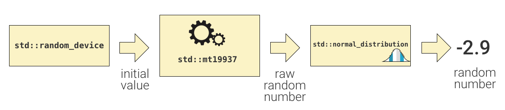

# Random Numbers: issues and parallelization

Random numbers are used in a wide variety of computing applications, most notably in security and scientific and mathematical simulations. The pseudo-random number generation (PRNG) algorithms that we can use in our computations have flaws that can be problematic to obtaining accurate results. As with other information about data storage we have studied, the long history of the C language, where it started on 32-bit architectures, gives rise to some of these issues. The fact that C started on computers that did not have thread libraries and enable parallelization is also a problem for running the early PRNG implementations on today's hardware and taking advantage of threads in our applications. We will study some of the issues in a code file that demonstrates multiple ways of creating random integers and real numbers, using C and C++ library functions. We will see how ultimately a C++ parallel version can give us fairly reasonable results.

Random numbers are distributed over a range of values and have a certain type. We will see examples of random integers between 0 and a value called RAND_MAX, and also how we might convert to real double values over a range from 0.0 to 1.0.

## Seeding the generator

All PRNG algorithms and their corresponding library functions are based on the concept of starting with one number, a **seed**, and manipulating it to get another number, then performing some other manipulation to get the next number, and so on. So the first issue when using any PRNG function is to be able to create some sort of seed, which for most generators should be a large positive integer value. 

###  One seed creates identical set of numbers

**Starting from one seed, you get the same 'stream' of random numbers by repeatedly calling a function to generate a new number.**  In C, the original function for this was called `rand()`. But this function is not even thread safe, so we will instead use the slightly more modern `rand_r`, which is what we call *reentrant*, and is guaranteed not to cause race conditions when running on separate threads.

####  The C rand_r version is not ideal
We will start with a version that uses `rand_r` so that you see what it is like. Also, you will see many versions of this, even just using `rand`, if you do searches online. **Avoid using this, even when you see it suggested in a search.**

Our ultimate goal is to create separate 'streams' of random numbers being generated, one per thread, by starting with different seeds. We will **simulate** this first by creating different random number streams sequentially in a loop.

The first step, then, is to determine how to create some sort of starting seed as a large number. Many pages from a web search will show using the `time` function to do this, since it returns this interesting value of the number of seconds since Jan. 1, 1970. (There is of course some interesting history behind this and the birth of UNIX.)

### Original C version

In the file `random_demo.cpp`, look for the function called:

    void genRandVals(int numTimes)

which then creates an array of seeds and calls `genSeedsLoop`

    unsigned int seeds[numTimes];
    genSeedsLoop(seeds, numTimes);  // try creating different seeds in a loop

Go back up in the file to find GenSeedsLoop, and note how it has many ways of creating the seeds, each commented out. The classic way that you see suggested a lot is uncommented:

    seeds[i] = (unsigned) time(NULL);

Now note in main near the end of the file that the older C approach is going to be run using this function:

    genRandVals(numTimes);

where numTimes is defaulted to 4, to simulate trying to make 4 separate streams of random values.

**Try it:** try using make to create this original first try. and run it:

    ./rand_demo

Scroll up to note the set of 4 seeds this generated. They are all the same or possibly off by one because increments of seconds that `time()` gives us is insufficient. Also notice that the streams of numbers are exactly the same. This is not what we would desire. Even if separate threads were doing this method, they still create the same time value when running concurrently.

Now try going to the function `genSeedsLoop`, which has some ways that are sometimes suggested to try to fix this issue. Keep the first line in the loop and uncomment the next line. This provides an attempt to get finer-grained time numbers by actually sleeping for a brief amount of time. Does this seem to work? Comment that out and uncomment the next line, which requires simply sleeping for a whole second before getting the next number. While this may work, it is not what we would like to have to do. The second from the last version tries to use a way to get numbers that are in milliseconds. Comment out all the lines above inside the loop and try it. Hopefully you can see that even this is problematic.

Ultimately, the only ways to generate different numbers is to use the loop counter and manipulate it in some way, then add it to the original time value. That last version inside the loop at least gives us different seeds and different streams of random integers, using the function `rand_r()`. But the way it was done, the seeds are not very different from each other. It is hard work to get them different from each other.

Let's try a different approach to getting seeds that are different large numbers by using newer libraries.

### Sequential Improved C++ version

Let's abandon the C way for now and examine a newer C++ library called <random.h> and how we might use it. We will also add the notion of creating a stream of real numbers (doubles) between 0.0 and 1.0.

Go down to main and comment out the C function call:

    genRandVals(numTimes);

And uncomment this line:

    genRandValuesCPP(numTimes);

This version still makes an array of seeds and creates them by calling this:

    genSeedsCPPLoop(seeds, numTimes);

Go take a look at this function to see how this is done. Note the use of a simplified random number generator class called `rd` to create seeds. You might want to look up how this works. It is certainly a much better way to create 32-bit random numbers to use as starting seeds.

Then notice how the function called `genRandomReal_IntStreamsCPP` in this random_demo.cpp code file is able to create a stream of real numbers between 0.0 and 1.0 from a given seeded engine and also create a stream of unsigned integers from the very same seeded engine. When you try to make and run it, Note how there is a different stream of numbers for the different seeded engine, called generator. The process works like this for both of them:

In this diagram, the seeds are provided by std::random_device and are used as a starting point for the std::mt19937 engine that will generate unsigned integers, which are then used by the std::normal_distribution to create a new random value.

In our examples, we have use two different distributions **each using the same generator engine**: 

- std::uniform_real_distribution<double> 
- std::uniform_int_distribution<unsigned int> 

There are many different types of distributions defined in the C++ std library (see references below).

####  **IMPORTANT:** 
One generator engine object was used to create both streams of random values under different distributions. In the picture above, the arrow labeled 'raw random number' can be duplicated and sent to different distribution objects. This is what the code in `genRandomReal_IntStreamsCPP` is doing. Various references, including [stack overflow posts](https://stackoverflow.com/questions/48093621/random-generators-with-multiple-uncorrelated-distributions-in-c), indicate that this is the way these should be used.

Save and make the version with `genRandValuesCPP(numTimes)` uncommented in main. Run it to see the results. When you try to make and run it, note how there is a different stream of numbers for each different seeded engine in the function `genRandomReal_IntStreamsCPP`, which is called for each of the times we indicate to make a new seed.

#### Ready for going parallel

This sequential version that uses the modern C++ <random> classes and functions forms the basis of how we can then have threads that each have their own starting seed for an engine and create random real double values in the range of 0.0 to 1.0 concurrently, along with unsigned integers (to demonstrate that threads can create numbers over different distributions or more than one of the same distribution).

### Further reading

This [article by Jonathan Boccara describing C++ random number generation](https://www.fluentcpp.com/2019/05/24/how-to-fill-a-cpp-collection-with-random-values/) provides a very good description of the need for a random engine generator such as std::mt19937 and separate distributions that create the values a programmer desires. The above image of the process came from this article. It gets very detailed at the end of the article, if you are interested in learning more about C++ object orientation.

This [article by Marc Paterno](http://www.open-std.org/jtc1/sc22/wg21/docs/papers/2004/n1588.pdf) describes the different types of distributions of values in general terms. This might be useful when looking at C++ documentation.

This [article by Walter E. Brown](http://www.open-std.org/jtc1/sc22/wg21/docs/papers/2013/n3551.pdf) is a nice general introduction to the C++ engines and distributions, listing them for reference.

### Parallel C++ Streams of Random numbers.

Now go back down to main and comment back out `genRandValuesCPP(numTimes)` again and uncomment the call to this function:

    parallelGenRandValues(numTimes);

In this version we include the same interesting requirement as in the sequential C++ version: *the need for more than one random value stream.* The concept here is that perhaps in order to solve a problem, we need multiple random values. One example is needing an X, Y (and even Z) coordinate on a grid. For example, the principle of diffusion of a gas or liquid in physics can be modeled using a Monte Carlo simulation that simulates random movement of a particle in 2D or 3D space. This is based on the mathematical random walk theory. The positions in space could come from two or three real number distributions over a desired range. In different example from gaming, to create a computer slot machine you would want three separate random values that represent the spins of each wheel. These could come from three integer distributions.

Study the code for this `genRandValuesCPP` function very carefully, line by line, and discuss with your classmate(s) exactly what this is doing. The comments should help, but be sure that you see why it is written the way it is. Then we will discuss it in class together.

Make it and run it to see that the results are being run by each thread concurrently.

### Special Notes

In this parallel version, the seeds are in an array, one per thread, and created by the main thread before threads are forked. This is necessary because the std::random_device class is not necessarily designed to be thread safe when run concurrently. It is best to create the seeds first in the main thread, then do the random number generation in parallel. In a similar vein, this is why each thread maintains its own private copy of the variables named generator, distribution, and intDistribution so that it can create its own independent streams of values without any race conditions or need for locking them with a critical section when they generate a new value using the distribution.

As stated earlier, it is best to have **one** seeded engine (called generator in the code) per thread that can use **multiple** distributions to create different numbers needed for a particular simulation or other application. It is perfectly fine to have two or more of the same distribution, such as uniform real numbers, that each use the same engine.

